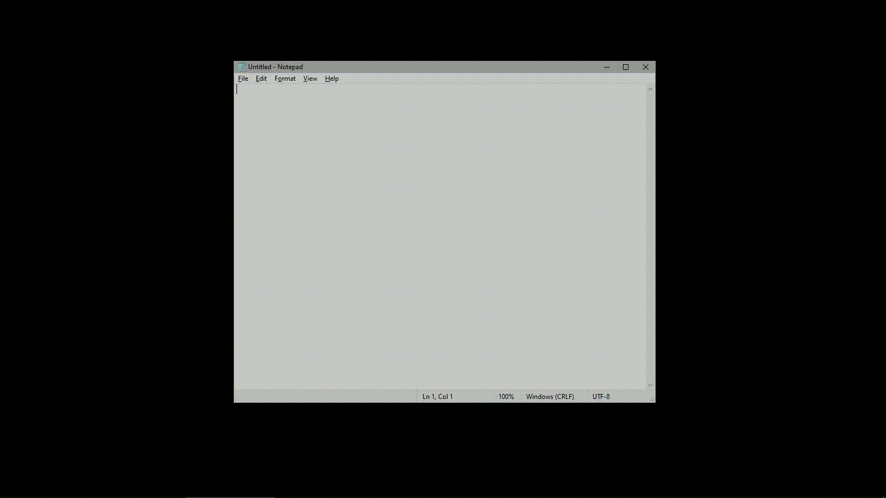

---

# Windows-playground

### ARE YOU TIRED OF MANUALLY DEFINING WIN32 API CONSTANTS OVER AND OVER?

### DO YOU ABSOLUTELY HATE WIN32 API?

### HAVE YOU EVER TRIED TO GET INTO CTYPES BUT FELT TOO INTIMIDATED BY THE STRUCTURES?

## WELL FEAR NOT, FOR ABSTRACTION IS HERE TO SAVE THE DAY!

# **INTRODUCING THE ALL NEW WINDOWS PLAYGROUND**

## Where you can treat Windows like your playground!

## Move windows around, hide them! Fade them!

## Hell, you can even make a platformer using only windows, in Windows!

---

With a simple:

```python
import winattr

windows = winattr.get_windows()
for item in windows:
    winattr.hide(item['hwnd'])

```

You can hide all the windows in your desktop. Good luck getting them back!

### Look at it bounce!


---


## Features & Usage

### winattr.py
You can easily modify and apply windows styles to individual windows based on HWNDs! Almost all functions in winattr.py only require the HWND as the argument, making interacting with windows much much simpler. Examples include:

* **ghost(hwnd)**: Makes the window see through and click through
* **adjust_window(hwnd, x=None, y=None, width=None, height=None)**: Resize or move the window
* **get_name(hwnd) and set_name(hwnd)**: Get the title or set the title of the window. However, the window's program will usually change the title back internally after an event
* **set_alpha(hwnd, value)**: Set the transparency of the window
* **bring_top(hwnd)**: Brings a window to the top.
* **pin(hwnd)**: Brings a window to the top, but you can't click away. unpin(hwnd) to unpin it
* **hide(hwnd)/show(hwnd)**: Hide or show a window. It removes it from taskbar and task switcher, and also moves it to System in the task manager

### Helper functions

* **get_windows(pretty=False)**: Returns a list of tuples, (hwnd, name)
* **winfov(hwnd)**: Stands for window info verbose, returns all styles of a window

### mouse.py
Instead of a setter/getter, the mouse properties have been conveniently wrapped in a `@property`, allowing you to access or modify the variable simply by calling mouse

```python
import mouse
import time
Rodent = mouse.Mouse()
print(f"Mouse X position: {Rodent.x}")
Rodent.x = 150
print("Hold down your mouse!")
time.sleep(2)
if Rodent.left_pressed:
    print("Left mouse button pressed!")
elif not Rodent.left_pressed:
    print(r"You didn't press the button :C")

```
Mouse.click(button, duration) to click
0 for LMB, 1 for RMB, and 2 for MMB

---

## Other modules
* `win_constants.py`: Includes massive amounts of constants and structures so you will never have to define them again.
* `winattr.py`: Includes functions to apply WS_STYLES and WS_EX_STYLES to individual windows.
* `winmgr.py`: spawn(class, title) to spawn a blank, white window. It still requires more development
* Keyboard wrappers: Still in development.
* `cli-hide.py`: My personal CLI tool. Run `win` without args to list windows, `win alias <HWND> <NAME>` to make an alias to a window handle (it's really convenient), and `win hide <ALIAS>` to hide that window. `win list` to list hidden aliases and hidden windows.
  WARNING: HWNDs are not persistent. If a window closes or a process terminates, the HWND will be invalid.
---

## Future Improvements

* Window order management. Get the topmost window, or based on Z order of stacking
* Better window creation management
* Window event managment

---

## Note

Run on a Windows 10 machine. May not work on other versions.


---
